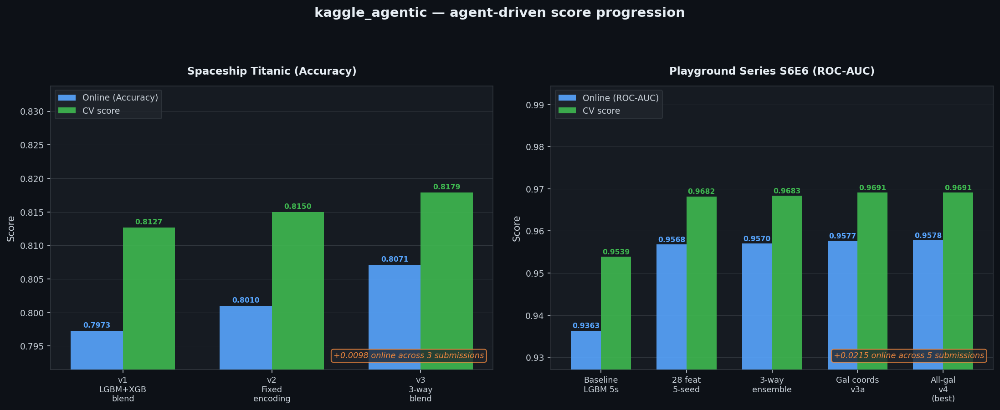

# Autonomous agents for datascience

A turnkey template for running an autonomous multi-agent datascience pipeline. It is adapted to kaggle competitions as an example but it could be adapted to any datascience task. Copy this directory, fill in one config file, and launch the orchestrator — it handles the rest.


---

## Results

The figure below shows score progression across two competitions run autonomously using this template. Each bar represents one submission; the orchestrator proposed the hypothesis, spawned the relevant agents, validated CV, and logged the result. No guidelines were provided.



| Competition | Metric | First submission | Best submission | Online gain |
|---|---|---|---|---|
| Spaceship Titanic | Accuracy | 0.7973 | 0.8071 | +0.0098 |
| Playground Series S6E6 | ROC-AUC | 0.9363 | 0.9578 | +0.0215 |

**Spaceship Titanic** — the orchestrator identified and fixed a label encoding bug (+374 bp, v2), then constructed a 3-way LightGBM + CatBoost + XGBoost blend (+608 bp total, v3).

**Playground Series S6E6** — feature engineer added spatial bins and redshift interactions (+202 bp online), ensemble agent blended three model families (+21 bp), and galactic coordinate features pushed the final best to 0.9578 ROC-AUC.


---

## How it works

```
You launch the orchestrator once.
The orchestrator runs a loop forever:
  ├── reads the competition assignment and your research guidelines
  ├── checks completed sub-agent results and commits improvements to git
  ├── reasons about the next experiment
  └── spawns specialist sub-agents in parallel
```

Sub-agents are one-shot `claude -p` processes. Each agent owns exactly one file, implements exactly one task, writes a `result.json`, and exits. The orchestrator is the only component that reads results, makes decisions, and authorises submissions. Using subagents helps with context management.

---

## Getting started

### 1. Set up the environment

This repo is written for MacOS/linux environment with Claude. Ask you own agent to adapt it to your own setup. The agents also rely on conda for package management with a default environment name `autoresearch`

```bash
conda create -n autoresearch
conda activate autoresearch
```

### 2. Copy the template for your own kaggle competition

```bash
cp -r datascience_agent <your-kaggle-slug>
```


### 3. Launch

```bash
cd <your-kaggle-slug>/agents/orchestrator
claude --dangerously-skip-permissions
```

In claude, run
```bash
/loop for kaggle competition <your-kaggle-slug>/
```

The orchestrator reads its `CLAUDE.md`, bootstraps with setup, data profiling, leakage checks, and a baseline model, then loops autonomously. The orchestrator logs online submission results to `results.tsv` and adjusts its CV calibration model.

### 4. Steer with guidelines

Edit `agents/orchestrator/workspace/guidelines.md` at any time to redirect research without interrupting the loop:

```markdown
## Experiments requested
- Try CatBoost with native categoricals
- Add group-level aggregate features
- Freeze fold protocol to StratifiedGroupKFold-5
```

---

## Score logging

Every online submission to Kaggle is appended to `results.tsv`:

```
date        variant                online_score  cv_score  submission_file   notes
2026-06-10  3way_lgbm_cb_xgb_v3   0.80710       0.8179    predictions.csv   3-way blend xgb+lgbm+cb. Best online.
```


---

## Agent roster

| Agent | CLAUDE.md | Owned file | Responsibility |
|---|---|---|---|
| **Orchestrator** | `agents/orchestrator/CLAUDE.md` | — | Strategy, task assignment, git commits, submission decisions |
| **Setup Competition** | `agents/setup_competition/CLAUDE.md` | `assignment.md`, `reports/` | Downloads competition overview, rules, and data from Kaggle |
| **Data Profiler** | `agents/data_profiler/CLAUDE.md` | `src/agents/data_profiler.py` | Schema, missingness, distributions, anomalies |
| **Feature Engineer** | `agents/feature_engineer/CLAUDE.md` | `src/features/engineering.py` | Feature construction and fold-safe transformations |
| **Model Trainer** | `agents/model_trainer/CLAUDE.md` | `src/agents/model_trainer.py` | Model variants and hyperparameter search |
| **Ensemble** | `agents/ensemble/CLAUDE.md` | `src/agents/ensemble_agent.py` | OOF-based blending and stacking |
| **Cross Validation** | `agents/cross_validation/CLAUDE.md` | `src/agents/leakage_detector.py` | CV protocol design, leakage audits, calibration tracking |
| **Submission Manager** | `agents/submission_manager/CLAUDE.md` | `src/agents/submission_manager.py` | Packaging predictions, format validation, Kaggle submission |

---

## Directory layout

```
datascience_agent/           — copy this entire directory per competition
  assignment.md              — fill this in: metric, schema, deadline, constraints
  run.py                     — unified entry point (--phase features|train|ensemble|submit|status)
  results.tsv                — scored submission log (date, variant, online, CV, notes)
  src/
    features/engineering.py  — owned by feature_engineer
    agents/
      data_profiler.py       — owned by data_profiler
      model_trainer.py       — owned by model_trainer
      ensemble_agent.py      — owned by ensemble
      leakage_detector.py    — owned by cross_validation
      submission_manager.py  — owned by submission_manager
    orchestrator.py          — pipeline runner (called by run.py)
  agents/
    orchestrator/
      CLAUDE.md              — orchestrator instructions (read on launch)
      workspace/
        state.json           — orchestrator working memory
        guidelines.md        — your research directives (edit any time)
        tasks/<agent>/
          task.json          — orchestrator writes before spawning
          result.json        — sub-agent writes when done
    <agent>/
      CLAUDE.md              — each agent's instructions
  experiments/
    features/                — feature parquets
    models/<variant>/        — OOF predictions + test probabilities
    ensemble/                — blended predictions
    submissions/             — packaged CSVs + sidecar JSONs
  data/                      — raw competition files (downloaded by setup agent)
  reports/                   — competition overview and rule PDFs
```


---

## Feature requests

### 1. Immutable experiment runs

Currently, re-running an experiment type (e.g. ensemble) overwrites the previous output. Each run should instead be written to a unique, append-only path:

```
experiments/
  models/runs/<run-id>/          — e.g. mt_003_20260610T142301/
  ensemble/runs/<run-id>/        — e.g. ens_002_20260610T153012/
  features/runs/<run-id>/        — e.g. fe_001_20260610T110045/
  submissions/runs/<run-id>/     — e.g. sub_001_20260610T170000/
```

`<run-id>` should be derived from the task id and a UTC timestamp so it is both human-readable and sortable. The orchestrator and all agents would write to `runs/<run-id>/` and register the path in `experiments/registry.jsonl`. This makes every experiment fully reproducible: you can re-run any past configuration by pointing at its run directory, and nothing is ever silently overwritten.

### 2. Model-agnostic agent instructions

Agent instructions currently live in `agents/<agent>/CLAUDE.md` files that contain Claude-specific CLI invocations (`claude -p`, `--model claude-haiku-4-5-20251001`, `--dangerously-skip-permissions`). These should be split into two layers:

- **`programs/<agent>.md`** — model-agnostic task specification: inputs, outputs, owned file, validation command, result schema. No provider-specific syntax.
- **`agents/<agent>/CLAUDE.md`** — thin adapter that sources the program file and adds Claude-specific invocation details.

This separation would allow the same programs to drive agents running on other LLM providers (GPT-4o, Gemini, local models via Ollama) with no changes to the core logic, only a different adapter layer.

### 3. More competition baselines

The agent performance is only shown for two competetions each run for approx. 1h. More baselines will help iterate on agent instructions for performance

### 4. Reduce token consumption

Several sources of unnecessary token use have been identified:

- **Sub-agent context bloat** — agents currently re-read the full `state.json` and `task.json` on every invocation. A trimmed context stub (task id, hypothesis, validate command, current best score) passed as a short `--prompt` flag would cut per-agent input tokens significantly.
- **Log verbosity** — agents pipe full training logs into their result JSON. Only the final metric line and any error tail should be included; raw logs should stay in `/tmp`.
- **Orchestrator re-reads** — the orchestrator reads the same large files (`assignment.md`, `guidelines.md`) every loop iteration even when they have not changed. A hash-based skip (read only when mtime changes) would eliminate redundant tokens at scale.
- **Result JSON size** — model result JSONs currently embed full OOF arrays inline. These should be written to a file path and only the path recorded in the JSON.
- **Prompt caching** — the static portions of each agent's `CLAUDE.md` (role, environment, output schema) are good candidates for prompt caching, which would reduce cost on repeated invocations of the same agent type across many iterations.
